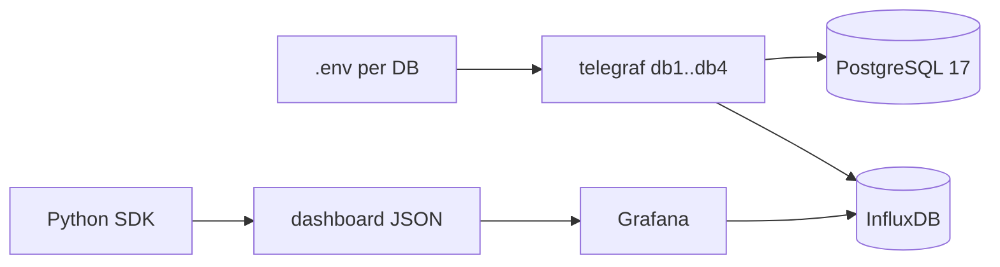

# Planning Status

> Resume point for short sessions. Update after every iteration.

| Iter | Date | What was done | Next |
|---|---|---|---|
| 1 | — | Draft plan v1 (6 stages) | Critical review |
| 2 | — | Critical review saved (tab **Critical Review**), plan v2 expanded: stack upgrade, RDS constraints, cardinality/top-N, per-DB connections, session protocol | Rewrite Delivery Steps |
| 3 | — | Delivery Steps rewritten to 7 stages matching T0–T8; legacy metrics list removed | Confirm A1–A5 (user reply may override defaults), then run T0 in the new repo |

**Open assumptions (to confirm, defaults used until then):**
- A1: targets are AWS RDS PG17 (because of the `rdsadmin` filter) → no superuser, use `pg_monitor`.
- A2: "4 databases" = 4 separate PG instances, each with 1 app database (if it's 1 instance with 4 DBs, cluster-wide metrics are collected once, per-DB metrics 4 times).
- A3: InfluxDB stays at 1.8 (InfluxQL) for now; upgrading to 1.11/2.x is out of scope.
- A4: Grafana gets upgraded to 11.x (required by grafana-foundation-sdk).
- A5: Telegraf gets upgraded to 1.3x (current 1.18 is from 2021).

# Critical Review

### Gaps found in draft v1
1. **Stack versions ignored.** `docker-compose.yml`: `postgres:10.16`, `influxdb:1.8.6`, `telegraf:1.18.3`, `grafana/grafana:8.0.2`. PG17 SQL won't run on PG10; grafana-foundation-sdk generates schema for Grafana 10/11 → upgrading the stack must be the **first** technical task.
2. **PG17 catalog changes not listed:** `pg_stat_statements` 1.11 (`total_time`→`total_exec_time` since PG13, `blk_read_time`→`shared_blk_read_time`, new `local_blk_*`, `jit_*`, `stats_since`, `minmax_stats_since`); `pg_stat_bgwriter` split → `pg_stat_checkpointer` (PG17); `pg_stat_io` (PG16+); `reserved_connections` (PG16+); `pg_stat_statements_info` (PG14+).
3. **Scope of connection matters.** `pg_stat_user_tables/indexes`, `pg_class` sizes are **per database** → each app DB needs its own connection; `pg_stat_statements`, `pg_stat_activity`, `pg_settings` are cluster-wide → collect once per instance, otherwise duplicate data.
4. **RDS constraints** (the `rdsadmin` filter): monitoring user needs `GRANT pg_monitor`; `pg_stat_statements` has to already be in `shared_preload_libraries` (parameter group) with `CREATE EXTENSION` done by the DBA — prerequisite, not something we do; `sslmode=require`; filter out `rdsadmin` / `rdsrepladmin`.
5. **Top-N breaks derivatives.** If a statement drops out of top-N the series has gaps and `non_negative_derivative` gives wrong results. Fix: rank by **cumulative** `total_exec_time` (stable) plus a union of top by `calls`; in tables use `spread()`/`last()-first()` over the time range; detect resets through `pg_stat_statements_info.stats_reset` / `stats_since`.
6. **Mask SQL cost/accuracy.** Triple `regexp_replace` over up to `pg_stat_statements.max` (default 5000) rows every 60s puts load on the production DB → statements interval 5 min, `max_query_text` limit, `LEFT JOIN pg_roles` instead of `pg_user` (roles without `LOGIN` get lost). The mask only collapses IN-lists with ≥2 params; add `ANY($0)` / `VALUES` variants. Compute the md5 on the full mask *before* `left()`.
7. **Current tags = query text** (`tagvalues = ["query",…]`) → cardinality explodes. Text must become a field, tags = md5/id.
8. **Output routing.** `telegraf.conf` uses `database_tag = "db_and_stand"`; the new inputs must set this tag (or a fixed `database`) or metrics end up in the wrong Influx DB.
9. **Drill-down details missing:** stable dashboard `uid`s, table data links `/d/<uid>?var-query_mask_md5=${__data.fields.query_mask_md5}&var-db_instance=${db_instance}&${__url_time_range}`.
10. **Process:** no resume protocol for short sessions, no status file, tasks too big (T5–T6 combined), no per-task verification commands.

# Requirements

### Overview & Goals
Monitor 4 PostgreSQL 17 databases with Telegraf → InfluxDB → Grafana. **No stored procedures** may be created on target DBs. Deliver English dashboard-runbooks (table-first, minimal, drill-down via `&var-query_md5=...`). Validate in docker-compose first, then port to k8s like `jcp-perftest-common` (`charts/`, `k8s/`, `docker/`).

### Scope
**In:** inline SQL for all inputs; `.env`-driven connection strings; one Telegraf container per DB (same query set); query-mask aggregation; connection-limit metrics (server + per-DB + per-role); grouped connection stats (state/application/user); index & statement drill-down dashboards generated in Python (grafana-foundation-sdk).
**Out (for now):** k8s deployment (last task), alerting, auto-remediation.

### User Stories
- As a perf engineer I open an Overview runbook and see if connections approach `max_connections` / `datconnlimit` / `rolconnlimit`.
- I see top query **masks** by total time and click an md5 to open a detail dashboard with full text and variants.
- I see unused/bloated indexes and seq-scan-heavy tables.

### Functional Requirements
- FR1 Config: Telegraf address = `${PG_DSN}` from `.env.<instance>`; global tags `db_instance=${PG_INSTANCE}`, `env=${PG_ENV}`; no secrets in git (`.env.example` only).
- FR2 No DB objects: every input is plain `SELECT` over system views; the monitoring user only needs `pg_monitor` + `CONNECT`.
- FR3 Connection limits: effective limit = `max_connections - superuser_reserved_connections - reserved_connections`; per-DB `datconnlimit` (-1 = unlimited → show as server limit); per-role `rolconnlimit`; usage % for each.
- FR4 Connection usage grouped by `state`, `application_name`, `usename`, `datname`, `wait_event_type`; oldest xact/state age.
- FR5 Statements: mask-level and queryid-level stats; tables show md5 + truncated text (≤120 chars); full text only on the detail board.
- FR6 Drill-down: Mask table → Statement Detail (`var-query_mask_md5`) → queryid variants → full text; time range and `db_instance` get carried over.
- FR7 Indexes/tables board: unused indexes, index size, seq-scan-heavy tables, dead tuples, last (auto)vacuum/analyze.
- FR8 Runbooks: every dashboard has a collapsed "Runbook" text row (symptom → panel → interpretation → action) plus a matching `docs/runbooks/<scenario>.md` in English.
- FR9 Tables are the main visualization; time series only where the trend matters (connections, TPS).

# Technical Design

### Current Implementation
- `config/telegraf/telegraf.d/inputs.postgresql_extensible.conf`: `pg_stat_statements` already inline; `pg_stat_activity_count/idle/idle_in_transaction/waiting` call `public.monitoring_*()` functions defined in `config/postgresql/monitoring_*.sql`. Address hardcoded `...:pass@sql_monitor_postgres:5432/postgres`.
- Dashboards: hand-made `config/grafana/provisioning/dashboards/json/{pgActivity,pgquery,pgstat}.json`.
- Problem: `query` text as Influx **tag** → high cardinality.

### Key Decisions
0. **Stack upgrade first:** postgres:17 (with `shared_preload_libraries=pg_stat_statements`), telegraf:1.3x, grafana:11.x, influxdb stays 1.8 (A3). Demo DB (`demo-small-20170815.sql`) + JMeter load stay as the local load generator.
1. **Inline SQL** replacing each `monitoring_*.sql` function body; PG17 columns (`pg_stat_statements` 1.11: `total_exec_time`, `toplevel`; `pg_stat_checkpointer`, `pg_stat_io`).
2. **Cardinality control:** tags = `db_instance, datname, usename, query_md5/query_mask_md5`; text stored as **field**; statements = top-N (default 200) by **cumulative** `total_exec_time` ∪ top-N by `calls`; separate low-frequency (30 min) `pg_stmt_text` measurement for md5→full text.
3. **Two statement measurements:** `pg_stmt` (per queryid, carries `query_mask_md5` for linking) and `pg_stmt_mask` (the user's GROUP BY query).
4. **Counters are cumulative** → tables use `spread()` / `last()-first()` over `$timeFilter`; time series use `non_negative_derivative(...,1s)`; resets tracked through `pg_stmt_info.stats_reset`.
5. **Dashboards as code in Python** (grafana-foundation-sdk) generating JSON into `config/grafana/provisioning/dashboards/json/`; Jsonnet (youtrack-sitespeed-tests) kept as reference only.
6. **One Telegraf service per DB instance** via compose `x-telegraf` anchor + `env_file: .env.<instance>`; identical `telegraf.d/` mounted read-only (pending Round-2 confirmation).
7. **Split inputs by scope & interval:** `cluster_*.conf` (activity 15–30s, settings 5m, statements 5m) connect to the maintenance DB; `database_*.conf` (tables/indexes 5m) connect to each app DB (`PG_DATABASES` list → one input per DB, generated by a small template script if needed).
8. **Stable dashboard UIDs** (`pg-overview`, `pg-connections`, `pg-statements`, `pg-statement-detail`, `pg-indexes`) so the drill-down links never break.

### Config context
`pg_settings_limits` also stores `shared_buffers`, `work_mem`, `statement_timeout`, `idle_in_transaction_session_timeout`, `pg_stat_statements.max`, `track_activity_query_size` as fields (context for runbooks).

### Data Contracts (Influx measurements)
| measurement | tags | key fields | interval |
|---|---|---|---|
| `pg_settings_limits` | db_instance | max_connections, superuser_reserved, reserved, effective_limit | 5m |
| `pg_db_limits` | db_instance, datname | datconnlimit, numbackends | 30s |
| `pg_role_limits` | db_instance, rolname | rolconnlimit, current | 30s |
| `pg_activity_grouped` | db_instance, datname, usename, application_name, state, wait_event_type | cnt, max_xact_age_s, max_state_age_s | 15s |
| `pg_stmt` | db_instance, datname, usename, queryid, query_md5, query_mask_md5, toplevel | calls, total_exec_time, rows, shared_blks_*, temp_blks_*, query_short (field) | 5m |
| `pg_stmt_mask` | db_instance, datname, usename, query_mask_md5 | sums of the above, variants, query_mask_short | 5m |
| `pg_stmt_text` | db_instance, query_md5 / query_mask_md5 | query / query_mask (field, ≤10000) | 30m |
| `pg_stmt_info` | db_instance | dealloc, stats_reset | 5m |
| `pg_db_stat` | db_instance, datname | xact_commit/rollback, blks_hit/read, temp_bytes, deadlocks | 60s |
| `pg_table_stat` / `pg_index_stat` | db_instance, datname, schemaname, relname[, indexrelname] | seq/idx scans, n_dead_tup, size, last_*vacuum | 5m |
| `pg_locks_blocked` | db_instance, datname | blocked, blocking | 15s |

### File Structure
- `.env.example`, `.env.db1..db4` (gitignored)
- `config/telegraf/telegraf.d/cluster_activity.conf`, `cluster_settings.conf`, `cluster_statements.conf`, `database_objects.conf`
- `config/postgresql/monitoring_*.sql` → kept only as reference, removed after T1
- `dashboards/` Python project: `builder/common.py`, `overview.py`, `connections.py`, `statements.py`, `statement_detail.py`, `indexes.py`, `Makefile`/`generate.sh`
- `docs/runbooks/*.md` + `docs/metrics-catalog.md`
- `PLAN.md`, `TASKS.md`, `STATUS.md`, `DECISIONS.md` (portable to new repo / `jcp-perftest-common` branch)

### Risks
- pg_stat_statements must be enabled + `pg_read_all_stats` role for monitoring user.
- Mask regex may merge distinct plans; keep queryid-level detail for drill-down.
- InfluxDB cardinality; mitigate with top-N and text-as-field.
- Top-N gaps → wrong derivatives (see Critical Review #5).
- Monitoring load on prod: regex over pg_stat_statements; mitigate with 5m interval, `statement_timeout` in DSN options (`options=-c statement_timeout=5000`).
- Grafana 8 → 11 upgrade may break the old `pgActivity/pgquery/pgstat.json` → keep them as legacy, don't migrate.

# Workflow & Tasks

### How tasks flow
Each task produces an artifact consumed by the next:
| Task | Input | Output artifact | Verification |
|---|---|---|---|
| T0 Bootstrap docs | this plan | `PLAN.md`, `TASKS.md`, `STATUS.md`, `DECISIONS.md` | files exist, T1–T8 have DoD |
| T1 Stack upgrade | compose | PG17+pgss, telegraf 1.3x, grafana 11 running | `docker compose up -d` + `psql -c "select * from pg_stat_statements limit 1"` |
| T2 One instance, inline SQL, .env | T1 | `cluster_activity.conf`, `.env.example`, no `monitoring_*()` calls | `telegraf --test` + `SHOW MEASUREMENTS` |
| T3 Runbook scenarios | T2 data | `docs/runbooks/*.md` (question → metric needed) | every scenario maps to ≥1 measurement |
| T4 Metrics catalog + SQL | T3 | `docs/metrics-catalog.md`, `sql/*.sql` tested on PG17 | each SQL runs as a `pg_monitor`-only user |
| T5 Collection + 4 instances | T4 | all `telegraf.d/*.conf`, compose anchor ×4 | `SHOW SERIES CARDINALITY` < budget, 4 `db_instance` values |
| T6 Overview/Connections boards | T5 | `dashboards/` Python, 2 JSON files | generator runs, Grafana provisioning log clean |
| T7 Statements/Detail/Indexes boards | T6 | 3 JSON files + data links | clicking md5 opens detail with var filled |
| T8 K8s port | T7 | chart/manifests like `jcp-perftest-common` | `helm template` / `kubectl apply --dry-run=client` |

### Runbook scenarios (T3 draft)
Template: Symptom → Where to look (dashboard/panel) → How to interpret (thresholds) → Likely causes → Actions → Related SQL. Extra scenario: pool misconfiguration (many idle connections per application).
Connection exhaustion; idle-in-transaction leaks; lock waits/blocking; slow query regression (mask top by time/call); cache hit drop / high reads; temp file spills; unused/missing indexes (seq_scan heavy); autovacuum lag/dead tuples; stats reset/dealloc in pg_stat_statements.

### Session protocol (short sessions)
- Start: read `STATUS.md` → current task in `TASKS.md` → relevant `DECISIONS.md` entries.
- Work in slices of ≤20 min; after each slice commit the artifact + append one line to `STATUS.md` (done / next / blockers).
- Each task has a single verification command; the task is done only once it passes.
- Never keep state only in the chat: SQL experiments go to `sql/scratch/*.sql`, results go to `docs/notes/*.md`.

### Working practices (agents-best-practices)
- `TASKS.md` with per-task: goal, inputs, output artifact, Definition of Done, verification command.
- One task = one branch/PR; small verifiable steps; every task ends with an executable check (`docker compose up`, Influx query, `python generate.py && jq` validation).
- Keep `PLAN.md` as the source of truth; decisions log appended.

### Testing
- `docker compose config` resolves env; Telegraf `--test` prints metrics for each input against local PG17.
- Influx query confirms measurements & tags; cardinality check via `SHOW SERIES CARDINALITY`.
- Generated dashboards load in Grafana provisioning without errors; drill-down link opens detail with var filled.

# Delivery Steps

### ✓ Step 1: T0 — Bootstrap working docs for short sessions
`PLAN.md`, `TASKS.md`, `STATUS.md`, `DECISIONS.md` exist and let any new session resume in <2 min.
- `PLAN.md` = Requirements + Technical Design + Critical Review from this plan.
- `TASKS.md` = T1–T8, each with goal, input, output artifact, DoD, one verification command, ≤20-min slices.
- `DECISIONS.md` = Key Decisions 0–8 + assumptions A1–A5.
- `STATUS.md` = append-only log (date, task, done, next, blockers).

### ✓ Step 2: T1+T2 — Upgraded stack monitoring one PG17 instance from .env with inline SQL
Local compose runs PG17 + Telegraf 1.3x + InfluxDB 1.8 + Grafana 11; Telegraf collects activity/statements from one instance with no DB-side functions.
- `docker-compose.yml`: `postgres:17` with `shared_preload_libraries=pg_stat_statements`; init script creates the extension and a `pg_monitor`-only `telegraf_monitoring_user`; telegraf/grafana images bumped.
- Replace `public.monitoring_*()` calls in `inputs.postgresql_extensible.conf` with inline SQL (bodies from `config/postgresql/monitoring_*.sql`); fix PG17 column names.
- Move query text from tags to fields; tags become md5/ids.
- `address = "${PG_DSN}"`, global tag `db_instance`, keep `db_and_stand` routing; `.env.example`, `.env*` gitignored.
- Verify: `telegraf --test` output and `SHOW MEASUREMENTS` / `SHOW TAG KEYS` in Influx.

### ✓ Step 3: T3+T4 — Runbook scenarios and metrics catalog with tested SQL
Every runbook question maps to a measurement whose SQL is tested on PG17 as a `pg_monitor` user.
- `docs/runbooks/<scenario>.md` (English, template Symptom → Panel → Interpretation → Causes → Actions) for ~10 scenarios.
- `docs/metrics-catalog.md` = Data Contracts table + SQL + interval + cardinality budget.
- `sql/*.sql`: limits, grouped activity, stmt (top-N union), stmt_mask (improved regex, md5 before `left()`, `LEFT JOIN pg_roles`), stmt_text, db/table/index stats, blocked locks.

### ✓ Step 4: T5 — Full metric collection for 4 instances
All catalog measurements land in InfluxDB for 4 `db_instance` values within the cardinality budget.
- Split `telegraf.d/` into `cluster_activity`, `cluster_settings`, `cluster_statements`, `database_objects` with per-input intervals.
- Compose `x-telegraf` anchor ×4 with `env_file: .env.db1..4`; per-DB inputs for app databases.
- DSN `options=-c statement_timeout=5000`, `sslmode` from env.
- Verify: `SHOW SERIES CARDINALITY`, per-instance counts.

### ✓ Step 5: T6 — Python dashboards-as-code: Overview and Connections runbooks
`dashboards/` generates `pg-overview` and `pg-connections` JSON that Grafana 11 provisions cleanly.
- grafana-foundation-sdk project: `builder/common.py` (datasource, `db_instance`/`datname` vars, runbook row, table helpers).
- Connections: limit usage % (server/db/role), grouped table by state/app/user, oldest xact.
- Overview: TPS, cache hit, temp, deadlocks, blocked sessions, links to other boards.
- `make dashboards` writes into `config/grafana/provisioning/dashboards/json/`.

### ✓ Step 6: T7 — Statements, Statement Detail and Indexes boards with drill-down
Clicking a mask md5 opens the detail board filtered by `var-query_mask_md5`, showing queryid variants and full text.
- `pg-statements`: mask table (`spread()` over range, truncated text, md5 data link).
- `pg-statement-detail`: variants by `query_md5`, full text from `pg_stmt_text`, calls/time series.
- `pg-indexes`: unused indexes, sizes, seq-scan-heavy tables, dead tuples/vacuum.
- Verify links carry the time range and `db_instance`.

### ✓ Step 7: T8 — Kubernetes port
The same Telegraf set and dashboards deploy the way `jcp-perftest-common` does (`charts/`, `k8s/`).
- One Telegraf deployment per instance from a values list; DSN in Secrets.
- Shared ConfigMap for `telegraf.d/`; dashboards ConfigMap from generated JSON.
- Verify with `helm template` / `kubectl apply --dry-run=client`.