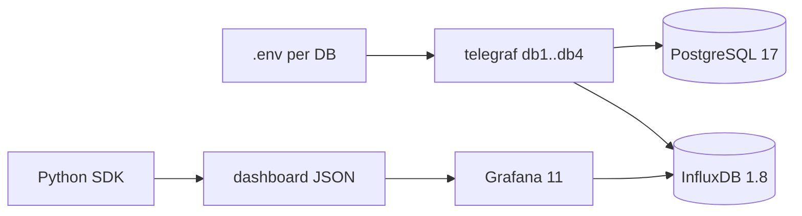

# PLAN — PostgreSQL 17 monitoring with Telegraf → InfluxDB → Grafana runbooks

> Source of truth. Resume protocol: `STATUS.md` → current task in `TASKS.md` → `DECISIONS.md`.

## Goal
Monitor 4 PostgreSQL 17 databases with Telegraf → InfluxDB → Grafana.
**No stored procedures / DB objects** may be created on target DBs.
Deliver English dashboard-runbooks (table-first, minimal, drill-down via `&var-query_mask_md5=...`).
Validate in docker-compose first, then port to k8s like `jcp-perftest-common` (`charts/`, `k8s/`, `docker/`).

## Scope
- **In:** inline SQL for all inputs; `.env`-driven connection strings; one Telegraf container per DB instance
  (same query set); query-mask aggregation; connection-limit metrics (server + per-DB + per-role);
  grouped connection stats (state / application / user); index & statement drill-down dashboards
  generated in Python (grafana-foundation-sdk).
- **Out (for now):** k8s deployment (last task), alerting, auto-remediation.

## User stories
- As a perf engineer I open an Overview runbook and see if connections approach
  `max_connections` / `datconnlimit` / `rolconnlimit`.
- I see top query **masks** by total time and click an md5 to open a detail dashboard with full text and variants.
- I see unused/bloated indexes and seq-scan-heavy tables.

## Functional requirements
- **FR1 Config:** Telegraf address = `${PG_DSN}` from `.env.<instance>`; global tags `db_instance=${PG_INSTANCE}`,
  `env=${PG_ENV}`; no secrets in git (`.env.example` only).
- **FR2 No DB objects:** every input is a plain `SELECT` over system views; the monitoring user only needs
  `pg_monitor` + `CONNECT`.
- **FR3 Connection limits:** effective limit = `max_connections - superuser_reserved_connections - reserved_connections`;
  per-DB `datconnlimit` (-1 = unlimited → show as server limit); per-role `rolconnlimit`; usage % for each.
- **FR4 Connection usage** grouped by `state`, `application_name`, `usename`, `datname`, `wait_event_type`;
  oldest xact / state age.
- **FR5 Statements:** mask-level and queryid-level stats; tables show md5 + truncated text (≤120 chars);
  full text only on the detail board.
- **FR6 Drill-down:** Mask table → Statement Detail (`var-query_mask_md5`) → queryid variants → full text;
  time range and `db_instance` are carried over.
- **FR7 Indexes/tables board:** unused indexes, index size, seq-scan-heavy tables, dead tuples,
  last (auto)vacuum/analyze.
- **FR8 Runbooks:** every dashboard has a collapsed "Runbook" text row
  (symptom → panel → interpretation → action) plus a matching `docs/runbooks/<scenario>.md`.
- **FR9 Tables** are the main visualization; time series only where the trend matters (connections, TPS).

## Critical review of draft v1 (kept as checklist)
1. Stack versions: compose had `postgres:10.16`, `influxdb:1.8.6`, `telegraf:1.18.3`, `grafana:8.0.2`
   → stack upgrade is the first technical task.
2. PG17 catalog changes: `pg_stat_statements` 1.11 (`total_exec_time`, `shared_blk_read_time`, `local_blk_*`,
   `jit_*`, `stats_since`, `minmax_stats_since`); `pg_stat_checkpointer` (PG17); `pg_stat_io` (PG16+);
   `reserved_connections` (PG16+); `pg_stat_statements_info` (PG14+).
3. Connection scope: `pg_stat_user_tables/indexes`, `pg_class` sizes are **per database**;
   `pg_stat_statements`, `pg_stat_activity`, `pg_settings` are cluster-wide → collect once per instance.
4. RDS constraints: `GRANT pg_monitor`; `pg_stat_statements` preloaded + extension created by DBA (prerequisite);
   `sslmode=require`; filter `rdsadmin` / `rdsrepladmin`.
5. Top-N breaks derivatives → rank by **cumulative** `total_exec_time` ∪ top by `calls`; tables use
   `spread()` / `last()-first()`; resets via `pg_stat_statements_info.stats_reset`.
6. Mask SQL cost: 5 min interval, `LEFT JOIN pg_roles`, md5 on the full mask **before** `left()`,
   extra mask rules for `ANY($0)` / `VALUES`.
7. Query text must not be a tag (cardinality) → text is a field; tags = md5/id.
8. Output routing: `telegraf.conf` routes by `database_tag = "db_and_stand"` → every input sets it.
9. Drill-down: stable dashboard `uid`s; data links
   `/d/<uid>?var-query_mask_md5=${__data.fields.query_mask_md5}&var-db_instance=${db_instance}&${__url_time_range}`.
10. Process: resume protocol, status file, small tasks, one verification command per task.

## Technical design

### Current implementation (before T1)
- `config/telegraf/telegraf.d/inputs.postgresql_extensible.conf`: `pg_stat_statements` inline;
  `pg_stat_activity_*` call `public.monitoring_*()` functions from `config/postgresql/monitoring_*.sql`;
  address hardcoded.
- Dashboards: hand-made `config/grafana/provisioning/dashboards/json/{pgActivity,pgquery,pgstat}.json` (legacy).

### Data contracts (Influx measurements)
| measurement | tags | key fields | interval |
|---|---|---|---|
| `pg_settings_limits` | db_instance | max_connections, superuser_reserved, reserved, effective_limit, + config context | 10m |
| `pg_db_limits` | db_instance, datname | datconnlimit, numbackends | 15s |
| `pg_role_limits` | db_instance, rolname | rolconnlimit, current | 15s |
| `pg_activity_grouped` | db_instance, datname, usename, application_name, state, wait_event_type | cnt, max_xact_age_s, max_state_age_s | 15s |
| `pg_stmt` | db_instance, datname, usename, queryid, query_md5, query_mask_md5, toplevel | calls, total_exec_time, rows, shared_blks_*, temp_blks_*, query_short (field) | 1m |
| `pg_stmt_mask` | db_instance, datname, usename, query_mask_md5 | sums of the above, variants, query_mask_short | 1m |
| `pg_stmt_text` | db_instance, query_md5 / query_mask_md5 | query / query_mask (field, ≤10000) | 10m |
| `pg_stmt_info` | db_instance | dealloc, stats_reset | 10m |
| `pg_db_stat` | db_instance, datname | xact_commit/rollback, blks_hit/read, temp_bytes, deadlocks | 1m |
| `pg_table_stat` / `pg_index_stat` | db_instance, datname, schemaname, relname[, indexrelname] | seq/idx scans, n_dead_tup, size, last_*vacuum | 10m |
| `pg_locks_blocked` | db_instance, datname | blocked, blocking | 15s |

### File structure (target)
- `.env.example`, `.env.db1..db4` (gitignored)
- `config/telegraf/telegraf.d/cluster_activity.conf`, `cluster_settings.conf`, `cluster_statements.conf`, `database_objects.conf`
- `config/postgresql/monitoring_*.sql` → reference only, removed after T2
- `sql/*.sql` — tested catalog SQL; `sql/scratch/` — experiments
- `dashboards/` Python project: `builder/common.py`, `overview.py`, `connections.py`, `statements.py`,
  `statement_detail.py`, `indexes.py`, `Makefile`
- `docs/runbooks/*.md`, `docs/metrics-catalog.md`, `docs/notes/*.md`

### Risks
- `pg_stat_statements` must be enabled; monitoring user needs `pg_monitor` (includes `pg_read_all_stats`).
- Mask regex may merge distinct plans → keep queryid-level detail for drill-down.
- InfluxDB cardinality → top-N, text-as-field, `SHOW SERIES CARDINALITY` budget check.
- Top-N gaps → wrong derivatives (review #5).
- Monitoring load on prod → 5m interval for statements, `options=-c statement_timeout=5000` in DSN.
- Grafana 8 → 11 may break legacy JSON boards → keep as legacy, don't migrate.

## Runbook scenarios (T3)
Template: Symptom → Where to look (dashboard/panel) → How to interpret (thresholds) → Likely causes → Actions → Related SQL.
Connection exhaustion; idle-in-transaction leaks; pool misconfiguration (many idle per application);
lock waits/blocking; slow query regression (mask top by time/call); cache hit drop / high reads;
temp file spills; unused/missing indexes (seq_scan heavy); autovacuum lag / dead tuples;
stats reset / dealloc in `pg_stat_statements`.
