<!-- _class: lead2
_footer: 'Cсылка на [слайды](https://polarnik.github.io/pg-sql-query-performance/index.perfconf.html), ссылка [на проект](https://github.com/polarnik/pg-sql-query-performance)'
-->


# Оптимизация запросов к PostgreSQL,<br> теория и практика

## __Смирнов Вячеслав, 2021__

<!--


История ускорения системы.
Про три месяца оформления и исправления дефектов большой системы,
которую можно услышать за тридцать минут и прожить за десять.

Как известно, инструмент подбирается под задачу.
Но для задачи визуализации статистики по SQL-запросам с точностью до минуты (или секунды, при желании) инструмента не было,
так чтобы инструмент работал в закрытой сети, работал под максимально высокой нагрузкой, не требовал модификаций PostgreSQL.
Инструмент был собран из открытых компонент: Telegraf, InfluxDB, Grafana. И отлично показал себя на проекте.
Позволив оформлять и исправлять дефекты в течение трех месяцев не отвлекаясь ни на что другое.
Что позволило достаточно быстро ускорить систему.

А если нужна детальная статистика с учетом значений параметров запроса, то это тоже возможно. За счет простого логирования и анализа лога.

Расскажу об опыте применения двух подходов к сбору и визуализации статистики, 
о том какие есть альтернативные подходы, которые не дали результата,
о том какие есть альтернативные решения, которыми вдохновлялся,
о том какие новые и полезные решения есть и появляются сейчас.

Аудитория и уровень

Доклад будет интересен инженерам по производительности и мониторингу систем, имеющим дело с PostgreSQL. Тем, кто стремиться не только тестировать и мониторить, но и оптимизировать, как саму систему так и механизм мониторинга.

Опыт оптимизации не требуется, но представление о том, что такое Java, SQL, PostgreSQL и Time Series Database нужно иметь.
-->

---

<!-- _class: title-->

# Тестирую и ускоряю ДБО для юридических лиц в банке ВТБ
## __Развиваю @qa_load__


<!-- 
Повышаю качество более десяти лет. Занимаюсь системой дистанционного банковского обслуживания юридических лиц. Основной профиль моей работы — тестирование производительности. Развиваю сообщество инженеров по тестированию производительности, помогая коллегам в telegram чате «QA — Load & Performance».
-->

---
<!-- _class: main
-->

# Об оптимизации SQL-запросов к PostgreSQL глазами инженера по тестированию нагрузки


---
<!-- class: head2 -->

# Содержание

1) Когда оптимизация SQL-запросов важна
2) Используемый инструментарий и его стоимость
3) Наработки на базе Telegraf, InfluxDB, Grafana, Selenium, Jenkins

6) Организация работ по ускорению SQL-запросов и их длительность
4) Чек-лист анализа запросов, какие метрики важнее других
5) Состав дефекта по ускорению запроса
5) Источники знаний и опыта

---
<!-- _class: main
-->

# Когда оптимизация SQL-запросов важна


---

# Высокая утилизация CPU на сервере баз данных


**__**

Метрики:

- Load Average > 2
- CPU Usage > 80%

---

# Суммарная длительность SQL-запросов в полке

**_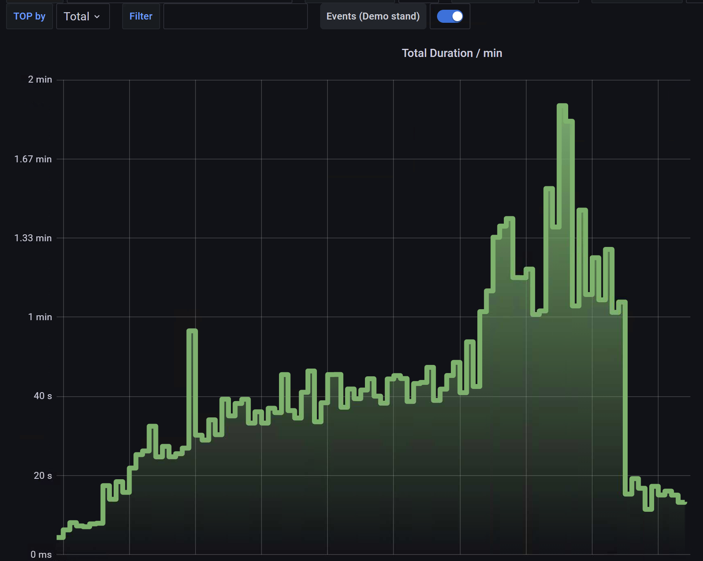_**

Вводные параметры:

- Минута работы БД
- Сервер с 20-ю CPU Core

Наблюдаемый результат:

- Суммарная длительность 
SQL-запросов около 
20-ти минут
за 1 минуту

---

# Нехватка подключений в логах сервисов

## __HikariPool: Connection is not available__

## __Unable to acqure JDBC Connection__

**_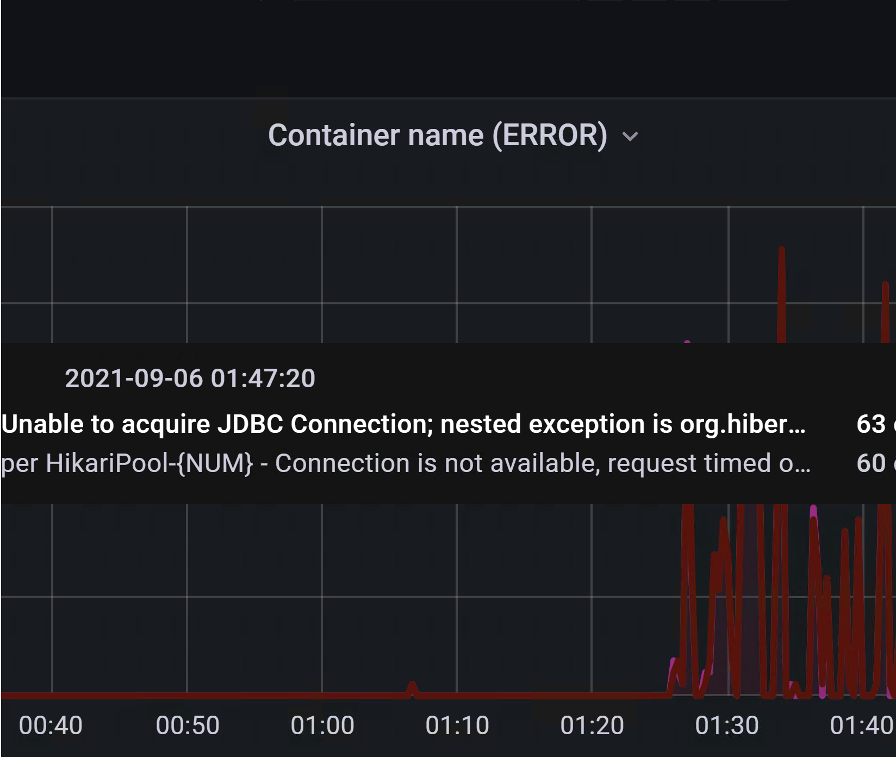_**

Различные ошибки 
нехватки 
подключений

---
<!-- _class: main
-->

# Используемый инструментарий и его стоимость


---

# Инструмент подбирается под задачу

## __Какие задачи предстоит решить:__

- Выбор запросов для анализа

- Поиск готового анализа
- Форматирование, подбор параметров, построение плана
- Статистика по параметрам запросов
- Анализ плана запроса и подбор индексов
- Оформление дефекта

---

# Мониторинг pg_stat_statements

## __В минимальном виде сбросить статистику и сохранить прирост за тест__

Сброс статистики:

```sql
select pg_stat_statements_reset()
```
Выборка после теста:
```sql
select * from pg_stat_statements 
```
> Нужны права суперпользователя или права на сброс статистики
---

# Мониторинг pg_stat_statements

## __В минимальном виде нужно посчитать разницу метрик за время теста__

Сохранить статистику в момент начала (start) и завершения (stop):

```sql
select * into stat_start from pg_stat_statements 
select * into stat_stop from pg_stat_statements 
```
Вычислить приращение по QueryID:
```sql
select b.total_time - a.total_time as t, b.queryid, b.query
from stat_stop b join stat_start a
on (b.queryid = a.queryid)
order by t DESC
```

---

# Мониторинг pg_stat_statements

## __В идеале, есть мониторинг__

**_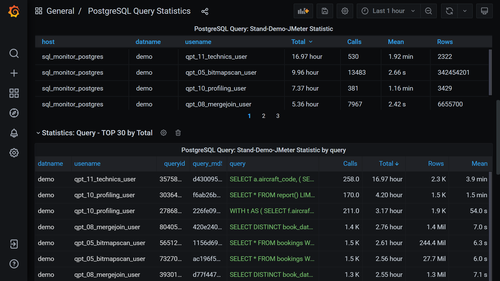_**

- в Grafana

- автоматический
- с сортировкой
- с фильтрами

### Около 1 месяца на настройку


---

# Confluence, Wiki

## __Поиск готового анализа по QueryID__

__*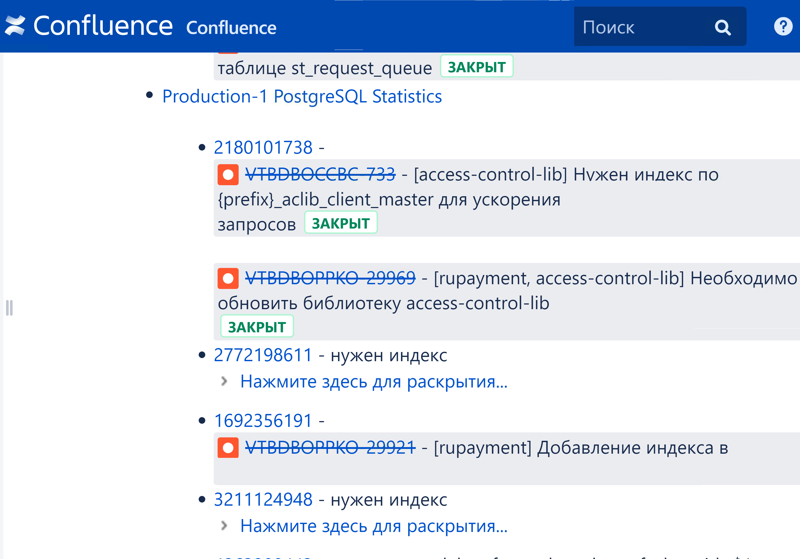*__ 

Удобно вести отчеты
с результатами
анализа

Для каждого QueryID
из TOP-5 делать
описание или дефект


### Confluence бесплатно для команд до 10-ти человек. А для больших команд большой бюджет


---

# DBeaver

## __Форматирование, подбор параметров__

__*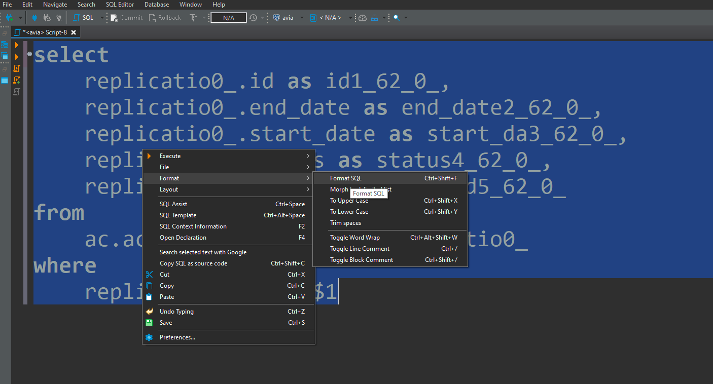*__ 

- Форматирование
- Поддержка $1, $2, ...
- Построение плана
```sql
explain 
(analize, buffers)
```

### DBeaver Community Edition бесплатен

---

# JProfiler, SublimeText, Excel

## __Статистика по параметрам запроса__

__*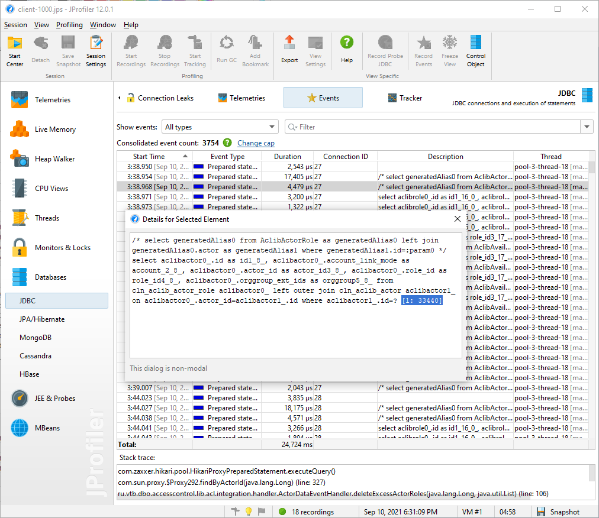*__ 

JProfiler может сохранить 
параметры SQL-запросов 
в результаты
профилирования

### JProfiler: $499 + 20% НДС SublimeText: $65 в год 

---

# DBeaver, PGAdmin 4, explain.tensor.ru

## __Анализ плана запроса и подбор индексов__

__*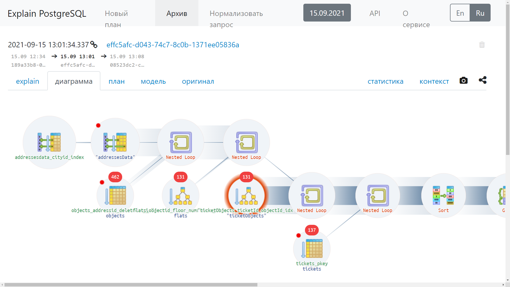*__ 

### Бесплатно

---

# DBeaver, Jira

## __Оформление дефекта__

__*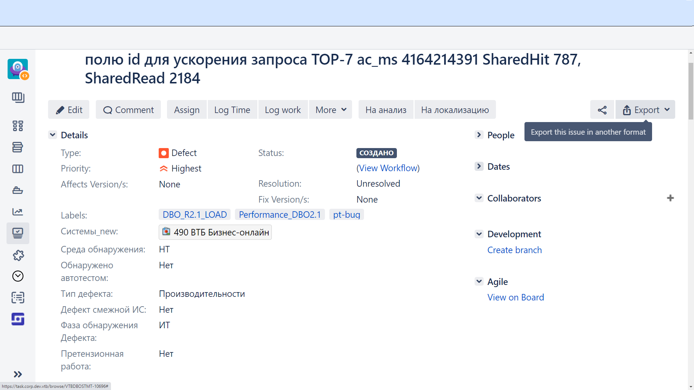*__ 

### Jira стоит много. Но она, обычно, есть

---
<!-- _class: main
-->

# Наработки на базе Telegraf, InfluxDB, Grafana, Selenium, Jenkins


---


---

<!-- _class: title -->

# Статистика по запросам в виде таблиц

## __С фильтрами по всем полям__


---

<!-- _class: title -->

# Детальная статистика по выбранному запросу

## __И не только это__


---

<!-- _class: title -->

# https://github.com/ polarnik/pg-sql-query-performance

## __Проект с демонстрацией__


---


# Как запустить проект

```bash
# Отдельно поднять сервер баз данных
docker-compose up db

# Остановить поднятый сервер БД
# <Ctrl+C> или командой
docker stop sql_monitor_postgres

# А теперь поднять все компоненты
docker-compose up

# Открыть Grafana
open 'http://localhost:3000'
```


---
<!-- _class: main
-->

# Организация работ по ускорению SQL-запросов и их длительность


---

# Сохранить результаты теста производительности

## __Grafana, Selenium, Confluence__
## __Автоматически__

**_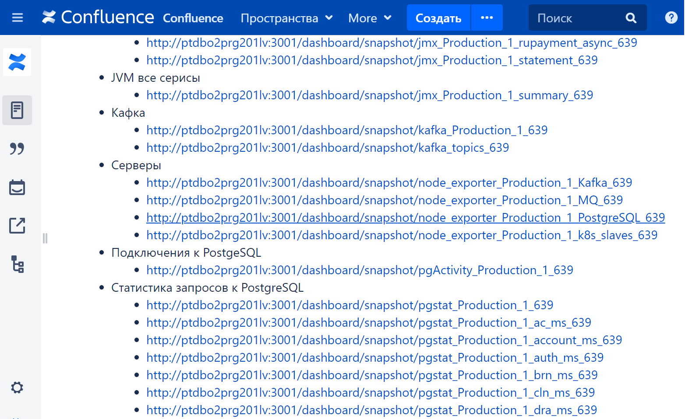_**


---

# Выбор TOP-запросов и краткий анализ

## __Grafana, Confluence__
## __Вручную__
## __2-6 часов__

**__**

---

# Выбор TOP-запросов по Total Time


---


---

# Построение планов запросов (вручную)

## __DBeaver__


**__**


### Может потребоваться подбор параметров $1. Простой способ — удалить фильтры WHERE

---

# Построение планов запросов (автоматически)

## __[auto_explain](https://www.postgresql.org/docs/10/auto-explain.html) для логирования__
## __[pgBadger](https://github.com/darold/pgbadger) для анализа логов__
## __Автоматически__

habr.com/ru/post/354948
автор: @SanSYS
фото pgBadger из статьи

### auto_explain и pgBadger бесплатны, но нужен доступ к логам PostgreSQL

**_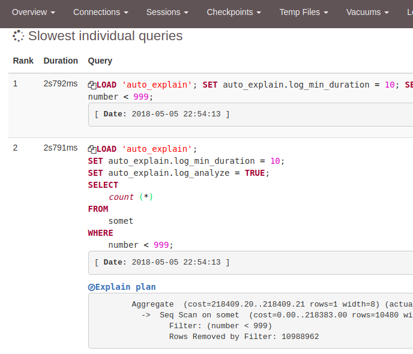_**

---

# Перехват параметров запроса (опционально)

## __Запустить тест__
## __Включить JProfiler__

## __Обработка csv в Sublime__
## __Анализ csv в Excel__

**__**

---

# Анализ плана запроса и подбор рекомендаций

## __в explain.tensor.ru (автоматически)__
## __в DBeaver или PGAdmin 4__

**__**

---

# Оформление дефекта

## __Jira__

**__**

---

# Длительность

## __2 дня (на один дефект)__

Если без профилирования

## __3 дня (на один дефект)__

С профилированием

---

| Этапы работ, автоматические и ручные | 👨‍💻 | ⚒️  |
| :------: | :---: | :----: | 
| Сохранить результаты теста | ⚙️ | Grafana, Selenium  |
| Выбор TOP-запросов, краткий анализ | 🖐️ | Grafana, Confluence | 
| Построение плана запроса | 🖐️ | DBeaver, PGAdmin| 1 |
| Сбор планов запросов | ⚙️ | auto_explain | |
| _Перехват параметров запроса (опция)_ | _🖐️_ | _JProfiler_ | _6_ |
| _Анализ параметров запроса (опция)_ | _🖐️_ | _SublimeText, Excel_ | _2_ |
| Анализ плана запроса и рекомендаций | ⚙️ | explain.tensor.ru | 2 |
| Анализ плана запроса и рекомендаций | 🖐️ | DBeaver, PGAdmin | 4 |
| Оформление одного дефекта | 🖐️ | Jira | 2 |


---

# Длительность массовой начальной обработки

## __3 дня (на группу дефектов) для одного человека__

* Без формирования рекомендаций по ускорению

* Без опыта оптимизации SQL-запросов
* Действуя по инструкциям


---

| _#_ | Этапы работ для одного человека | 👨‍💻 | ⚒️ |
|---| :------: | :---: | :----: | 
| _1_ | Сохранить результаты теста | ☑️⚙️ | Grafana, Selenium |
| _2_ | Выбор TOP-запросов, краткий анализ | ☑️🖐️ | Grafana, Confluence |
| _3_ | Построение/получение плана запроса | ☑️🖐️ | DBeaver, auto_explain | 
| _4_ | Оформление дефекта без рекомендации | ☑️🖐️ | Jira |
|_5_| _Перехват параметров запроса (опция)_ | _👨‍🏫🖐️_ | _Jenkins, JProfiler_ | 
|_6_| _Анализ параметров запроса (опция)_ | _👨‍🏫🖐️_ | _SublimeText, Excel_ |
|_7_| _Анализ плана запроса и рекомендаций_ | _👨‍🏫⚙️_ | _explain.tensor.ru_ | 
|_8_| _Анализ плана запроса и рекомендаций_ | _👨‍🏫🖐️_ | _DBeaver, PGAdmin_ | 
|_9_| _Добавление рекомендаций в дефект_ | _👨‍🏫🖐️_ | _Jira_ | 

---

# Длительность формирования рекомендаций

## __Ещё 1-3 дня (на группу дефектов) уже для двух человек__

* Возможно, понадобится профилирование

* Возможно, создание индексов будет долгим

> У разработчиков, обычно, нет времени на исследования
и нет стенда с большой базой данных

---

| _#_ | Этапы работ для двух человек | 👨‍🏫👨‍💻 | ⚒️ |
|---| :------: | :---: | :----: | 
|_1_| _Сохранить результаты теста_ | _☑️⚙️_ | _Grafana, Selenium_ |
|_2_| _Выбор TOP-запросов, краткий анализ_ | _☑️🖐️_ | _Grafana, Confluence_ |
| _3_ | _Построение/получение плана запроса_ | _☑️🖐️_ | _DBeaver, auto_explain_ | 
|_4_| _Оформление дефекта без рекомендации_ | _☑️🖐️_ | _Jira_ |
|_5_| Перехват параметров запроса (опция) | 👨‍🏫🖐️ | Jenkins, JProfiler | 
|_6_| Анализ параметров запроса (опция) | 👨‍🏫🖐️ | SublimeText, Excel |
|_7_| Анализ плана запроса и рекомендаций | 👨‍🏫⚙️ | explain.tensor.ru | 
|_8_| Анализ плана запроса и рекомендаций | 👨‍🏫🖐️ | DBeaver, PGAdmin | 
|_9_|  Добавление рекомендаций в дефект | 👨‍🏫🖐️ | Jira | 


---
<!-- _class: main
-->

# Чек-лист анализа запросов, какие метрики важнее других


---

# TOP-запросы: по Total Time


---

# Нехватка индекса: (SharedHit+SharedRead)/Count

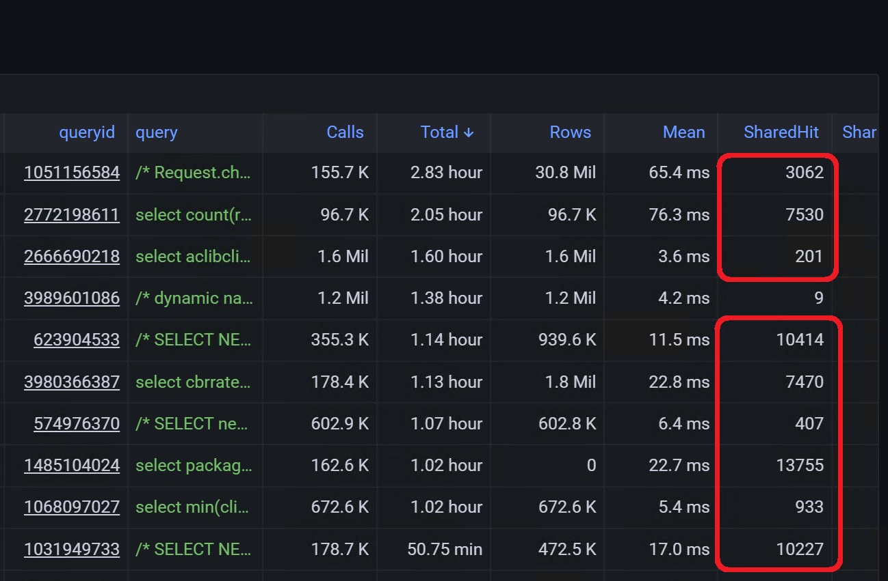

---

# «N+1 select problem»: диспропорции Count

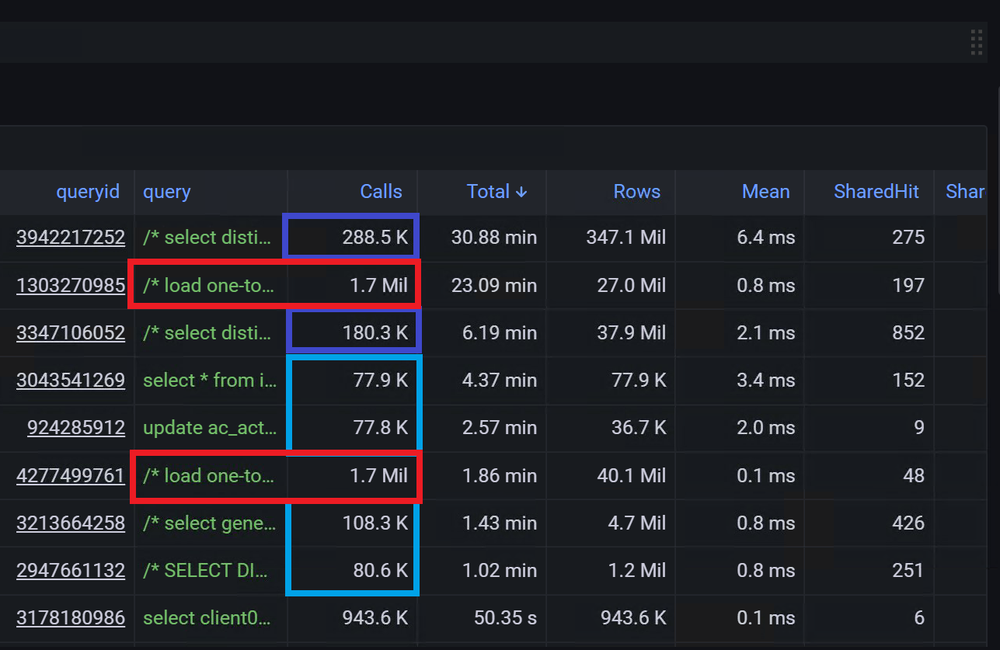

---
<!-- _class: main
-->

# Состав дефекта по ускорению запроса


---

# Заголовок

[СЕРВИС] Необходим индекс в таблице ТАБЛИЦА по полю ПОЛЕ для ускорения запроса TOP-111 ПОЛЬЗОВАТЕЛЬ QUERY_ID SharedHit 11111, SharedRead 2222

> Заголовки помогают найти дефекты, ведь их будет много


# [auth] Необходим индекс в таблице auth_users по полю id для ускорения запроса TOP-1 auth_user 987987128 SharedHit 901, SharedRead 20


---

# Окружение

```
Нагрузочный стенд LOAD-2
версия auth 1.1.1.8
```

> Просто хороший тон

---

# Медленный запрос

```
Медленный запрос TOP-1 auth_user (+ ссылка на Grafana)
```

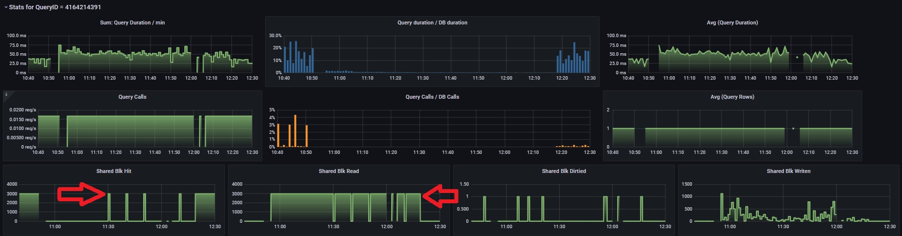


---

# Текст запроса

```sql
delete from lnp.npanxx_block
    where status isnull
    and (npanxx, block_id) not in (
        select
            npanxx,
            block_id
        from lnp.npanxx_block_source
        where status isnull
    )
    returning 1
```

---

# План запроса до оптимизации

```sql
Delete on npanxx_block  (cost=0.00..81967834804.63 rows=612435 width=6)
  ->  Seq Scan on npanxx_block  
      (cost=0.00..81967834804.63 rows=612435 width=6)
        Filter: ((status IS NULL) AND (NOT (SubPlan 1)))
        SubPlan 1
          ->  Materialize  (cost=0.00..128977.33 rows=1255870 width=8)
                ->  Seq Scan on npanxx_block_source  
                    (cost=0.00..117791.98 rows=1255870 width=8)
                      Filter: (status IS NULL)
```

---

# Рекомендуемый индекс

```sql
create index fix1_AUTH_7654_npanxx_block_partial_idx
on npanxx_block(id)
where (status IS NULL);


create index fix2_AUTH_7654_npanxx_block_source_partial_idx
on npanxx_block_source(id)
where (status IS NULL);

```

> Можно не заполнять

---

# План запроса после добавления индекса

```sql
Delete on npanxx_block  (cost=0.00..11967834.63 rows=612435 width=6)
  ->  Index Scan using fix1_AUTH_7654_npanxx_block_partial_idx 
      on npanxx_block  
      (cost=0.00..11967834.63 rows=612435 width=6)
        Filter: (NOT (SubPlan 1))
        SubPlan 1
          ->  Materialize  (cost=0.00..128977.33 rows=1255870 width=8)
                ->  Index Scan using fix2_AUTH_7654_npanxx_block_source_partial_idx 
                    on npanxx_block_source  
                    (cost=0.00..117.98 rows=1255870 width=8)
```
> Можно не заполнять

---

# Было / Стало

Было:
```sql
Delete on npanxx_block  (cost=0.00..81967834804.63)
```
Стало:
```sql
Delete on npanxx_block  (cost=0.00..11967834.63)
```
> Важно показать факт ускорения метриками

---

# Проверка после исправления

Работа сервиса auth во время регулярного теста производительности ускорится. Проявляется на стенде load-2

Медленный запрос ускорится: 
* ShredHit по запросу был 2222222, станет 2

Перед установкой новой версии удалить индексы
* fix1_AUTH_7654_npanxx_block_partial_idx
* fix2_AUTH_7654_npanxx_block_source_partial_idx

> Очень нужный раздел, чтобы не проверять исправление на пустой БД

---
<!-- _class: main
-->

# Источники знаний и опыта


---

# postgrespro.ru/education/courses

Описание курсов команды PostgresPro

# edu.postgrespro.ru

Сами курсы

# github.com/polarnik/pg-sql-query-performance

Демо стенд с мониторингом и базой данных курса

---
<!-- class: head2 -->

# Выводы

1) Смотрите на утилизацию CPU и ошибки подключений к БД
2) Почти все инструменты бесплатны, auto_explain сэкономит время подбора плана, explain.tensor.ru сэкономит время анализа
3) Рекомендую наработки github.com/polarnik/pg-sql-query-performance

6) Работы стоит разделить на два этапа по 3 дня: сначала без индексов 
4) Обращайте внимание на TotalTime, SharedHit и на Count
5) Добавляйте планы запросов в дефект и условия проверки
5) Обучайтесь на postgrespro.ru/education/

---

<!-- _class: lead2
-->

# Вопросы/ответы<br> Оптимизация запросов к PostgreSQL

## __Смирнов Вячеслав, @qa_load__


