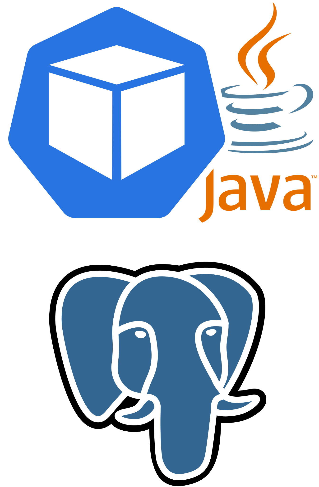
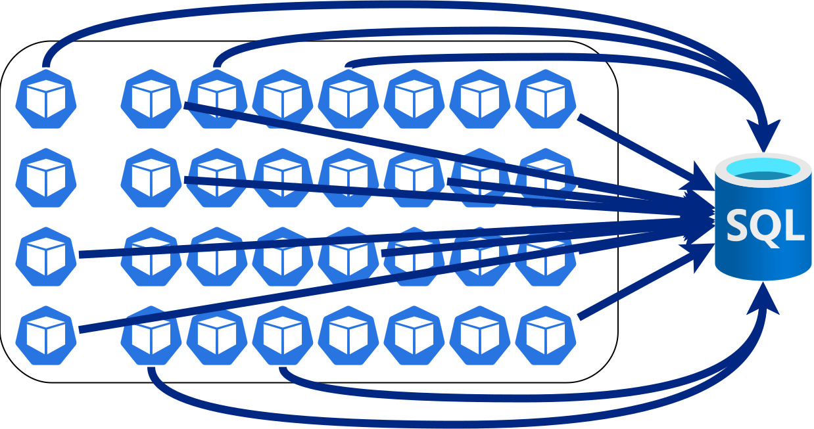
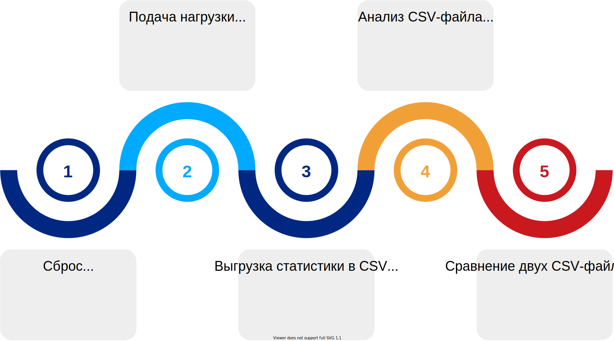
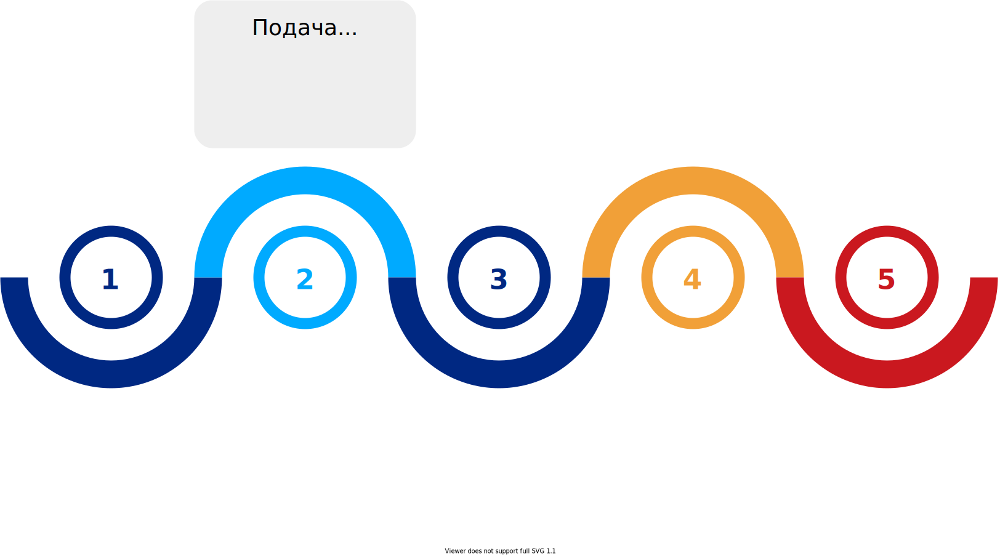
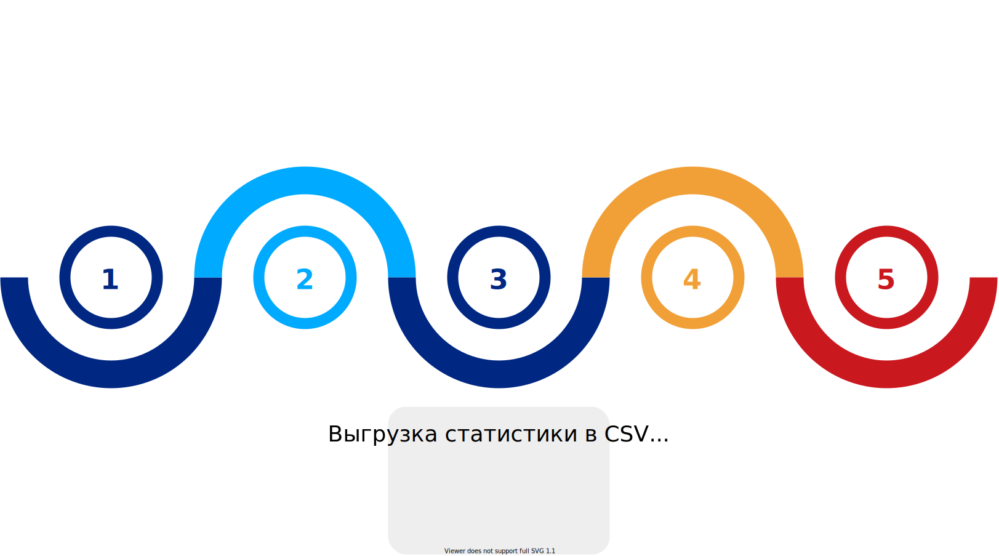
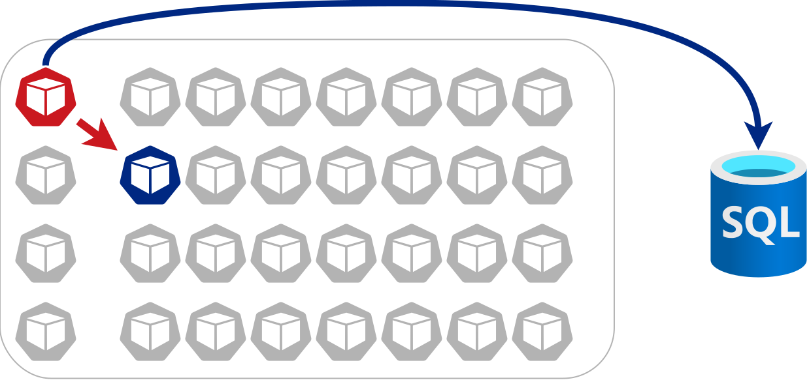
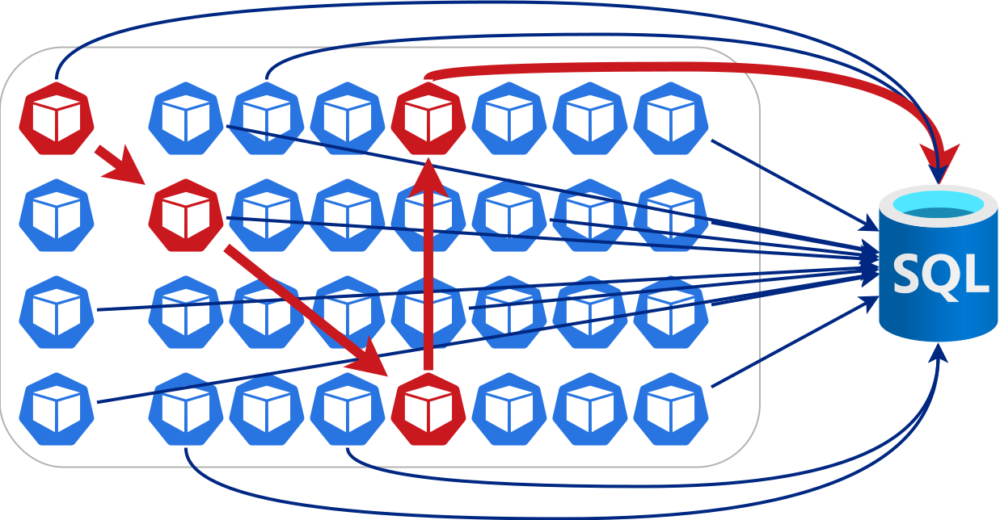
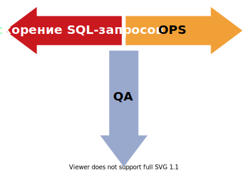
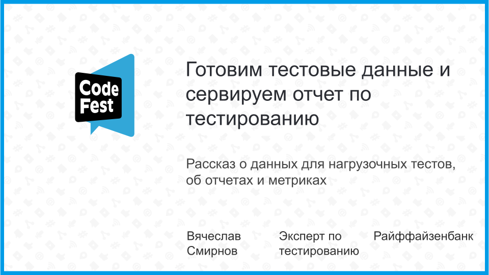
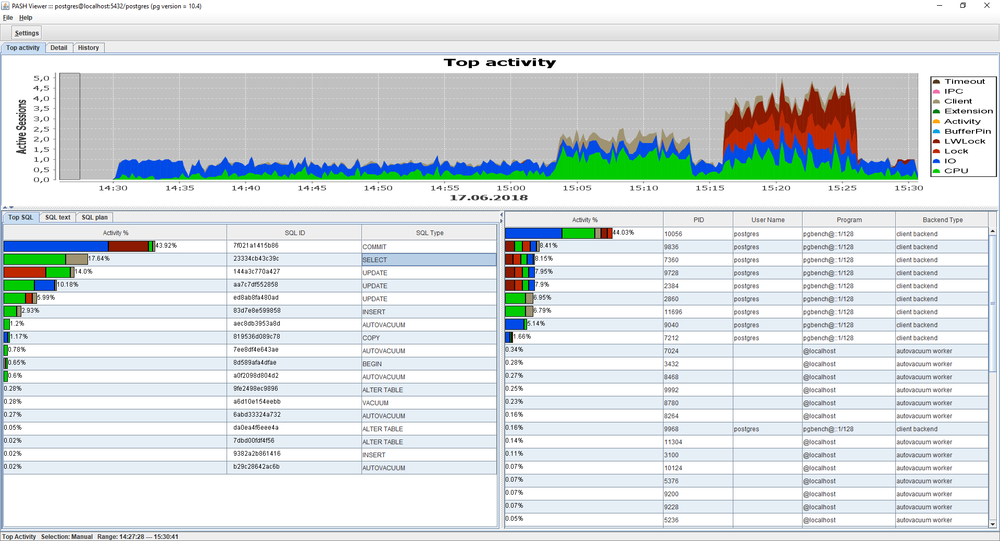

<!-- _class: lead2
_footer: 'Смирнов Вячеслав, 2021 (ссылка на [слайды](https://polarnik.github.io/pg-sql-query-performance/), ссылка [на проект](https://github.com/polarnik/pg-sql-query-performance))'
-->

# Мониторинг, анализ и оптимизация запросов к PostgreSQL
## __Из слона (Postgres) муху (баги)__

<!--
История ускорения системы.
Про три месяца оформления и исправления дефектов большой системы,
которую можно услышать за тридцать минут и прожить за десять.

Как известно, инструмент подбирается под задачу.
Но для задачи визуализации статистики по SQL-запросам с точностью до минуты (или секунды, при желании) инструмента не было,
так чтобы инструмент работал в закрытой сети, работал под максимально высокой нагрузкой, не требовал модификаций PostgreSQL.
Инструмент был собран из открытых компонент: Telegraf, InfluxDB, Grafana. И отлично показал себя на проекте.
Позволив оформлять и исправлять дефекты в течение трех месяцев не отвлекаясь ни на что другое.
Что позволило достаточно быстро ускорить систему.

А если нужна детальная статистика с учетом значений параметров запроса, то это тоже возможно. За счет простого логирования и анализа лога.

Расскажу об опыте применения двух подходов к сбору и визуализации статистики, 
о том какие есть альтернативные подходы, которые не дали результата,
о том какие есть альтернативные решения, которыми вдохновлялся,
о том какие новые и полезные решения есть и появляются сейчас.

Аудитория и уровень

Доклад будет интересен инженерам по производительности и мониторингу систем, имеющим дело с PostgreSQL. Тем, кто стремиться не только тестировать и мониторить, но и оптимизировать, как саму систему так и механизм мониторинга.

Опыт оптимизации не требуется, но представление о том, что такое Java, SQL, PostgreSQL и Time Series Database нужно иметь.
-->

---

<!-- _class: title-->

# Тестирую и ускоряю ДБО для юридических лиц в банке ВТБ
## __Развиваю @qa_load__

<!-- 
Повышаю качество более десяти лет. Занимаюсь системой дистанционного банковского обслуживания юридических лиц. Основной профиль моей работы — тестирование производительности. Развиваю сообщество инженеров по тестированию производительности, помогая коллегам в telegram чате «QA — Load & Performance».
-->

---
<!-- _class: main 
_footer: ''
footer: 'О чем доклад'
-->

# О чем доклад 

---
<!-- _class: head 
-->

# О мониторинге и оптимизации SQL-запросов и ...

1) Как не раздуть из мухи слона в анализе производительности
2) Как написать дефект, от которого можно посчитать эффект

3) Отображение за секунду месячной статистики по SQL

4) Как и зачем выполнять трассировку SQL-запросов

---

> «Ценность любой практики зависит от ее контекста»

Джем Канер, Джеймс Бах, Брайан Марик и Брет Петтичорд

> «The value of any practice depends on its context»

Cem Kaner, James Bach, Brian Marick, Bret Pettich

---
<!-- _class: main 
_footer: ''
footer: 'Контекст'
-->

# Контекст

---

<!-- _class: title -->

# 100 JVM работающих друг с другом и базой
## __На тестовом стенде__

---
<!-- _class: head -->

# Узким местом была база данных

- База данных выросла и стала узким местом, замедлилась

- Утилизация CPU на сервере PostgreSQL близка к 100%
- Микросервисам не хватает пула подключений
- Подключений к PostgreSQL уже 10 000
- Много ошибок в логах сервисов
- Медленные ответы сервисов

---

---

---

---

---
<!-- _class: head -->

# Стал нужен источник метрик по SQL-запросам

## __Но не просто срез статистики для ручного сравнения и анализа, а ...__

- с удобным сравнением: запрос ускорился на X процентов

- с хранением статистики за длительный интервал
- с гибким выбором интервалов для сравнения
- с высокой точностью сбора метрик
- с быстрым отображением данных
- с отображением интенсивности

---

---
<!-- _class: main 
_footer: ''
footer: 'Что получилось'
-->

# Что получилось

---
<!-- _class: main 
_footer: ''
footer: 'Как не раздуть из мухи слона в анализе производительности'
-->

# Как не раздуть из мухи слона в анализе производительности

---

<!-- _class: head -->

# Иногда приходится тестировать на заглушках

---

<!-- _class: head -->

# Если тестировать на заглушках

## __Мы найдем дефекты производительности__

- В одном компоненте, при быстрых ответах от окружения
- При большом масштабировании компонента

## __Мы упустим__

* Многие сценарии использования
* Дефекты взаимодействия
* Другие компоненты

---

<!-- _class: head -->

# Приходится тестировать на пустых базах данных

---

<!-- _class: head -->

# Если тестировать на пустых базах данных
## __Мы найдем дефекты производительности__

- Дефекты взаимодействия при быстрых ответах от базы данных
- Очень частые SQL-запросы, что можно кешировать
- Утечки подключений, файлов, ...

## __Мы упустим__

* Многие сценарии использования
* Большую часть медленных SQL-запросов и блокировок
* Расходы памяти на большие данные
* Обработку больших коллекций

---

<!-- _class: title 
_footer: 'Изображение с сайта <a href="https://i.imgur.com/VuyIVW0.jpg">imgur.com</a>'
-->

# Есть много способов найти дефекты производительности

## __Которых не будет в продуктиве__

---

<!-- _class: head -->

# Сделать лишнюю работу или получить отказ

## __Что может услышать инженер__

> _Мы что-то поправили, проверь_

> _Дефект когда-нибудь проанализируем_

> _Дефект больше не воспроизводится — закрываем_

---

<!-- _class: title 

_footer: 'Изображение c сайта <a href="https://cdn.wallpapersafari.com/23/35/RA5mfj.jpg">wallpapersafari.com</a>'
-->

# Тут легко сделать из мухи слона

---
<!-- _class: head -->

# Повышая приоритет непроверенных дефектов

## __Инженер:__

> «Прошу проанализировать и исправить дефект, <strike>эффект уже проверен</strike>»
> «Дефект важен, ускорение будет, <strike>для ключевой операции на 70%</strike>»

## __Команда:__

> «Поправили, __но на DEV-стенде нет эффекта__»
> «Проверь на нагрузочном стенде»

---

<!-- _class: head -->

# Но есть проверенный способ изменить ситуацию

## __Что может сделать и сказать инженер__

> _Поправить предлагаю так, уже проверено_

> _Ускорение ключевой операции на 70%_

> _Влияния на функциональность нет_

---

<!-- _class: title 

_footer: 'Изображение с сайта <a href="https://i.imgur.com/VuyIVW0.jpg">imgur.com</a>'

-->

# Можно сделать из  слона (PostgreSQL) муху (дефекты)

## __Проверенные дефекты__

---

---

---

<!-- _class: head -->

# Используя непустые базы данных
## __Доклад по генерации данных: https://o.codefest.ru/lecture/1674__

---
<!-- _class: head -->

# И оптимизируя SQL-запросы на тестовом стенде

## __Стенд нагрузки (большая БД с данными) позволяет оптимизировать__

- __долгие запросы (active) с предсказуемыми планами__
- долгие транзакции (idle in transaction)
- нехватка подключений (idle)
- блокировки (blocked)

## __А стенд разработки (малая БД на контейнерах) не позволяет, ведь__

- планы запросов парадоксальные: __sequnce scan__ вместо __index scan__
- таблицы маленькие
- запросы быстрые

---
<!-- _class: head -->

# Эффект будет и для продуктива для репутации

## __Инженер:__

> «Дефект поправить предлагаю так, **эффект уже проверен**»
> «Дефект важен, ускорение будет, **для ключевой операции на 70%**»

## __Команда:__

> «Поправили, **есть эффект даже на DEV-стенде**»
> «**Спасибо!**»

---
<!-- _class: main 
_footer: ''
footer: 'Как написать дефект, от которого можно посчитать эффект'
-->

# Как написать дефект, от которого можно посчитать эффект

---

# Долгие запросы и Active state

* Выбор наиболее медленных SQL-запросов

* Анализ интенсивности SQL-запроса
* Среднее и максимальное время
* Другие важные метрики

---

# Долгие транзакции и Idle in transaction state

* Выбор SQL-запросов в долгих транзакциях

* Поиск кода, вызывающего SQL-запрос
* Анализ причин зависания

---

# Нехватка подключений и Idle state

* Выбор сервисов с неиспользуемыми подключениями

* Справедливое распределение подключений

* Настройки времени жизни подключений

---
<!-- _class: head -->

# Блокировки и Blocked state

## __Как правило, причина в долгих запросах__

---
<!-- _class: head -->

# Блокировки и Blocked state

## __Детализацию хорошо показывает [PASH Viewer](https://github.com/dbacvetkov/PASH-Viewer) Дмитрия Цветкова__

---
<!-- _class: main 
_footer: ''
footer: 'Отображение за секунду месячной статистики по SQL'
-->

# Отображение за секунду месячной статистики по SQL

---
<!-- _class: head -->

# В InfluxDB все теги индексируются сразу

## __И основная задача в уменьшении этих индексов__

* Как компактно хранить SQL-запросы в InfluxDB

* Как детализировать статистику по запросу
* Как сравнить статистику по двум тестам

---
<!-- _class: main 
_footer: ''
footer: 'Для чего и как выполнять трассировку SQL-запросов'
-->

# Для чего и как выполнять трассировку SQL-запросов

---
<!-- _class: head -->

# Для чего выполнять трассировку SQL

## __Partial-индексы и вот это вот все__

* Почему мы не знаем параметры

* Почему важно знать параметры

* Примеры запросов и их параметров

---
<!-- _class: head -->

# Как выполнять трассировку SQL

## __Выбери свой способ__

* Угадываем параметры

* Параметры из профилирования

* Параметры из логов трассировки JDBC

* Параметры из логов трассировки Hibernate

* Параметры из логов планов запросов PostgreSQL

* Перехват параметров с JDBC Proxy

---
<!-- _class: main 
_footer: ''
footer: 'Приложение: инструменты'
-->

# Приложение: инструменты

---
<!-- _class: head -->
# Мониторинг

- APM, Application Performance Monitoring-системы New Relic, Dynatrace
- ELK + [логи приложения](https://www.playframework.com/documentation/2.8.x/AccessingAnSQLDatabase#How-to-configure-SQL-log-statement) с медленными SQL-запросами
- [PgBadger](https://pgbadger.darold.net/) + [логи PostgreSQL](https://pgbadger.darold.net/documentation.html#POSTGRESQL-CONFIGURATION) с медленными SQL-запросами
- Утилита [PASH Viewer](https://github.com/dbacvetkov/PASH-Viewer) и системы мониторинга: okmeter.io
- [pg_stats_statements](https://www.postgresql.org/docs/10/pgstatstatements.html) и Prometheus [exporter](https://github.com/prometheus-community/postgres_exporter) или [Telegraf](https://github.com/influxdata/telegraf/tree/master/plugins/inputs/postgresql_extensible) + InfluxDB
- [pg_profile](https://github.com/zubkov-andrei/pg_profile) для сравнительных [отчетов](https://pgconf.ru/media/2020/02/04/%D0%90%D0%BD%D0%B4%D1%80%D0%B5%D0%B9%20%D0%97%D1%83%D0%B1%D0%BA%D0%BE%D0%B2%20-%20pg_profile.pdf)

- [pg_stat_monitor](https://github.com/percona/pg_stat_monitor) для PostgreSQL 11+ или [pg_stat_plans](https://github.com/2ndQuadrant/pg_stat_plans) и доступ к статистике через SQL

---
<!-- _class: head -->
# Трассировка (с параметрами)

- Коммерческие профайлеры [JProfiler](https://www.ej-technologies.com/products/jprofiler/overview.html), [YourKit](https://www.yourkit.com/java/profiler/features/)

- [TRACE-логи](https://jdbc.postgresql.org/documentation/head/logging.html) PostgreSQL JDBC Driver
- [TRACE-логи](https://stackoverflow.com/questions/1710476/how-to-print-a-query-string-with-parameter-values-when-using-hibernate) для org.hibernate.type и DEBUG-логи для org.hibernate.sql
- [CSV Log](https://www.postgresql.org/docs/10/runtime-config-logging.html#RUNTIME-CONFIG-LOGGING-CSVLOG) + [debug_print_parse](https://www.postgresql.org/docs/10/runtime-config-logging.html#RUNTIME-CONFIG-LOGGING-WHAT), debug_print_plan, debug_pretty_print
- Расширение [auto_explain](https://www.postgresql.org/docs/10/auto-explain.html) и анализ логов PostgreSQL
- Логирование с Side Effect Injection: [AspectJ](https://www.eclipse.org/aspectj/), [Byteman](https://byteman.jboss.org/), [jMint](https://github.com/Toparvion/jmint)
- JDBC Proxy [P6Spy](https://github.com/p6spy) (нужно встраивать в сервис)

---
<!-- _class: lead2
_footer: 'Мониторинг, анализ и оптимизация SQL-запросов (ссылка на [слайды](https://polarnik.github.io/pg-sql-query-performance/), ссылка [на проект](https://github.com/polarnik/pg-sql-query-performance))'
-->

# Давайте обсудим   доклад   «Из слона муху»
## __owasp@ya.ru, @qa_load__